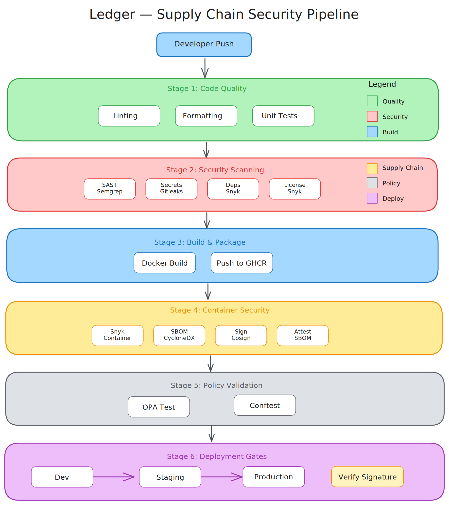

# Ledger — Supply Chain Security Workflow

<!-- Pipeline Status Badges -->
[](https://github.com/adamatdevops/ledger-supply-chain-security/actions/workflows/secure-pipeline.yml)
[](https://github.com/adamatdevops/ledger-supply-chain-security/actions/workflows/multi-language-security.yml)

<!-- Feature Badges -->
[](/.github/workflows/secure-pipeline.yml)
[](#security-gates)
[](/src/policies)
[](#features--capabilities)
[](#features--capabilities)
[](#features--capabilities)
[](/LICENSE)
[](/src/app)
[](/src/app/package.json)

---

A practical reference implementation of a **software supply chain security pipeline** designed for regulated environments (Fintech, Healthcare, Enterprise).

This repository demonstrates architectural thinking around **SBOM generation**, **artifact signing**, **provenance attestation**, and **policy-as-code governance** — not a production system, but a portfolio-ready pattern.

---

## Problem Statement

Modern software delivery requires security to be:

- **Automated** — not a manual gate
- **Early** — shift-left, not shift-right
- **Consistent** — same rules across all repos
- **Auditable** — traceable for compliance

Most teams bolt security on as an afterthought. Ledger demonstrates how to **design supply chain security into the pipeline from day one**.

---

## Architecture Overview



For detailed architecture, see [docs/architecture.md](docs/architecture.md).

---

## Features & Capabilities

### Security Gates

| Gate | Tool | Blocks On |
|------|------|-----------|
| Static Analysis (SAST) | Semgrep | High/Critical findings |
| Secret Detection | Gitleaks | Any detected secret |
| Dependency Vulnerabilities | Snyk | Critical CVEs |
| Container Vulnerabilities | Snyk Container | High/Critical CVEs |
| License Compliance | Snyk | Copyleft in proprietary |
| SBOM Generation | Syft | Attestation failure |
| Policy Validation | OPA/Conftest | Policy violations |

### Pipeline Characteristics

- **Fail-fast**: Security issues block before build
- **Parallel scanning**: Multiple tools run concurrently
- **Caching**: Dependency caches reduce scan time
- **Reproducible**: Pinned tool versions
- **Auditable**: All findings logged and exportable

### Supported Environments

- `dev` — All scans, warnings only
- `staging` — All scans, blocks on high+
- `prod` — All scans, blocks on medium+, requires approval

---

## Repository Structure

```
ledger-supply-chain-security/
├── README.md
├── ARCHITECTURE_OVERVIEW.md
├── CONTRIBUTING.md
├── SECURITY.md
├── CONTEXT.md
├── PROMPT.md
├── SECURITY_GATES.md
├── PIPELINE_POLICY_MODEL.md
├── RISK_NOTES.md
├── THREAT_MODEL.md
├── docs/
│   ├── architecture.md
│   ├── diagrams/
│   │   ├── pipeline-flow.svg
│   │   └── security-gates.svg
│   └── adr/
│       ├── 0001-choose-github-actions.md
│       ├── 0002-snyk-for-vulnerability-scanning.md
│       └── 0003-semgrep-for-sast.md
├── .github/
│   ├── workflows/
│   │   ├── secure-pipeline.yml
│   │   ├── security-scan.yml
│   │   └── container-scan.yml
│   ├── ISSUE_TEMPLATE/
│   └── PULL_REQUEST_TEMPLATE.md
├── examples/
│   ├── sample-app/
│   └── policy-examples/
├── scripts/
│   ├── local-scan.sh
│   └── generate-sbom.sh
└── src/
    └── policies/
        ├── container-policy.rego
        └── deployment-policy.rego
```

---

## Sample Application (Pipeline Validation Workload)

This repository includes a sample service located at:

```
src/app/
```

The application serves as a **realistic workload** to exercise the pipeline end-to-end. It enables validation of:

- **SAST scanning** (Semgrep)
- **Dependency & container scanning** (Snyk)
- **SBOM generation** (Syft/CycloneDX)
- **Image signing & attestation** (Cosign/Sigstore)
- **Policy-as-Code evaluation** (OPA/Conftest)

The purpose of this sample app is not to act as a product service, but to provide a **controlled execution surface** for demonstrating a secure software supply-chain flow in a way that mirrors real enterprise environments.

This ensures the project showcases a **true operational pipeline** — not just a collection of tools, but a complete end-to-end security governance pattern.

---

## Quick Start

### Prerequisites

- GitHub repository with Actions enabled
- Container registry (ECR, GHCR, etc.)
- Optional: Snyk token for enhanced scanning

### 1. Copy Workflow Files

```bash
cp -r .github/workflows/ /path/to/your-repo/.github/workflows/
```

### 2. Configure Secrets

```yaml
# Required secrets in GitHub repository settings
CONTAINER_REGISTRY: ghcr.io/your-org
SNYK_TOKEN: (optional) your-snyk-token
```

### 3. Trigger Pipeline

Push to any branch to trigger the secure pipeline.

---

## Production Considerations & Trade-offs

### What This Pattern Does Well

- **Shift-left security**: Catches issues before merge
- **Automation**: No manual security review bottleneck
- **Auditability**: Full trail of all security decisions
- **Consistency**: Same rules across all repositories

### Known Limitations

- **False positives**: Semgrep/Snyk may flag non-issues
- **Scan time**: Full security scan adds 3-8 minutes
- **Tool coverage**: No single tool catches everything
- **Context blindness**: Tools don't understand business logic

### When to Use This Pattern

- Regulated industries (Fintech, Healthcare)
- Enterprise environments with compliance requirements
- Teams scaling beyond manual security review
- Organizations building software supply chain security

### When NOT to Use This Pattern

- Early-stage prototypes where speed > security
- Internal tools with no external exposure
- Environments without CI/CD capability

---

## Interview Discussion Points

This repository demonstrates:

1. **Security architecture thinking** — not just tool usage
2. **Trade-off analysis** — understanding tool limitations
3. **Compliance awareness** — audit trails, policy gates
4. **Platform engineering** — reusable, consistent patterns
5. **DevSecOps maturity** — security as code, not afterthought

Key questions this repo helps answer:

> "How do you integrate security into CI/CD?"
> "What's your approach to shift-left security?"
> "How do you handle compliance in automated pipelines?"
> "Walk me through your DevSecOps strategy."

---

## Related Resources

- [OWASP CI/CD Security](https://owasp.org/www-project-devsecops-guideline/)
- [SLSA Framework](https://slsa.dev/)
- [Sigstore](https://sigstore.dev/)
- [NIST SSDF](https://csrc.nist.gov/Projects/ssdf)

---

## License

MIT License — See [LICENSE](LICENSE) for details.

---

**Note**: This repository is a practical reference implementation for portfolio and interview purposes. It demonstrates architectural patterns and engineering thinking, not production-ready code.
